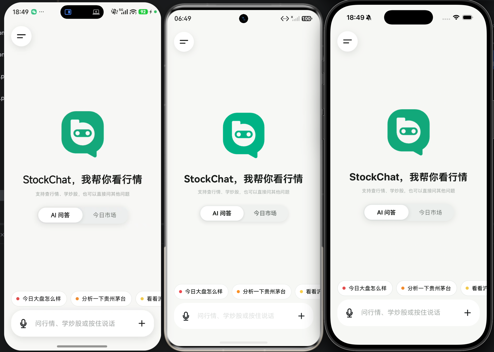

# StockChat · Kuikly AI 股票工作台

StockChat 是一个基于 Kotlin Multiplatform 与 Kuikly 构建的跨端 AI 股票应用。用户可以用自然语言提问，AI 回答会直接嵌入可点击的实时行情卡片；从卡片进入个股详情后，可以查看走势、AI 解读和预测节点，再把选中的点位带回聊天继续追问。

项目使用一套共享的业务与 UI 代码运行在 **Android、iOS 和 OpenHarmony**，并将行情、AI、多模态输入、图表和会话产物串成一条完整的产品链路。

> 行情与 AI 结论均为演示信息，仅供参考，不构成投资建议。

## 评审入口

| 内容 | 入口 |
| --- | --- |
| Android 安装包 | [StockChat-1.0-release-debugsigned.apk](docs/release/StockChat-1.0-release-debugsigned.apk) |
| Android 演示 | [StockChat Android Demo.mp4](docs/media/StockChat%20Android%20Demo.mp4) |
| iOS 演示 | [StockChat iOS Demo.mp4](docs/media/StockChat%20iOS%20Demo.mp4) |
| OpenHarmony 演示 | [StockChat OHOS Demo.mp4](docs/media/StockChat%20OHOS%20Demo.mp4) |
| 安装包说明 | [docs/release/README.md](docs/release/README.md) |

### 一分钟体验路径

1. 播放任意一个三端演示视频，先看「聊天提问 → 行情卡片 → 个股详情 → AI 解读」主链路。
2. Android 评审 APK 已预置模型配置，安装后即可体验 AI；源码构建请按下方说明填写 `local.properties`。
3. 按下表检查课题要求：

| 课题 | 对应功能 |
| --- | --- |
| Task 1：AI 股票行情原型 | 行情列表、搜索、个股详情、分时 / K 线、AI 分析与风险提示 |
| Task 2：AI 股票问答应用 | Markdown 问答、结构化行情卡片、卡片跳转详情、详情点位带回会话 |

演示视频使用 Git LFS 管理。源码检出后执行 `git lfs pull` 即可播放；Android 安装包为调试签名的 Release 包，仅用于体验与评审。

## 项目亮点

- **一套代码覆盖三端**：共享业务与 UI 逻辑，同时支持 Android、iOS 和 OpenHarmony。
- **AI 问答结合实时行情**：自然语言提问后，回答中直接插入可点击的行情卡片，支持快速回答与联网精准实时数据两种模式。
- **个股详情与 AI 预测联动**：提供分时、五日、日 K、周 K、月 K、均线和交互式节点，预测结果接续真实走势展示，并可将点位带回聊天继续追问。
- **会话内容可沉淀**：会话中提到的标的可生成横向对比表和 Mermaid mindmap，支持本地保存、归档与分享。
- **完整的多模态体验**：支持图片提问、语音输入、回答朗读，以及今日市场、收藏卡片和多模型服务商配置。
- **可复用的跨端组件**：内置 `kuikly-chart` 金融图表库与 `table-core` 表格组件库，可独立复用到其他 Kuikly 项目。

## 验证命令

准备 JDK 17、Android SDK 34 和根目录 `local.properties` 后，可以执行共享层回归测试与 Android Debug 构建：

```bash
./gradlew :shared:testDebugUnitTest :kuikly-chart:testDebugUnitTest :table-core:testDebugUnitTest
./gradlew detekt :androidApp:assembleDebug
```

安装前请阅读[安装包说明](docs/release/README.md)。



## 环境要求

| 组件 | 版本 |
| --- | --- |
| JDK | 17 |
| Gradle | 8.7（使用仓库内 `./gradlew`） |
| Kotlin | 2.1.21 |
| Kuikly | 2.26.0-2.1.21 |
| KuiklyMarkdown | 1.0.6-2.1.21 |
| Android Gradle Plugin | 8.6.1 |
| Android SDK | compileSdk 34，minSdk 23 |
| iOS | Xcode + CocoaPods，部署目标 iOS 14.1 |
| OpenHarmony | DevEco Studio |

## API Key 配置

在仓库根目录的 `local.properties` 填写一次：

```properties
QWEN_API_KEY=你的百炼_API_Key
MIMO_VOICE_API_KEY=你的_MiMo_API_Key
```

**Android、iOS、OpenHarmony 的 Debug 和 Release 都会把这份配置打进安装包。** 填好后重新构建、安装即可直接使用，无需在应用设置中再次输入 Key。修改本地配置后重新构建即可更新包内配置。

如使用仓库内的 [`ai-proxy`](ai-proxy/README.md)，也可配置代理地址和访问令牌：

```properties
AI_PROXY_BASE_URL=https://你的域名/v1
AI_PROXY_TOKEN=代理服务的访问令牌
```

配置代理地址后，应用会把 `AI_PROXY_TOKEN` 当作客户端到代理的凭证，并自动改用代理地址；`QWEN_API_KEY` 不再需要写入客户端。`AI_PROXY_TOKEN` 不是百炼 Key。

也可用同名环境变量覆盖。`QWEN_API_KEY` 用于文本 / 视觉问答、标的识别与 AI 预测，`MIMO_VOICE_API_KEY` 用于语音；应用内的模型配置页可以在运行时另行添加服务商与 Key。


## 构建与运行

以下命令均从当前检出的仓库目录运行；三平台共用根目录的 `local.properties`。

### 先决条件

- JDK 17、Gradle 已可执行。
- 本机已安装并授权：
  - Android Studio（项目同步 Kotlin Multiplatform）
  - Xcode（iOS）
  - CocoaPods（iOS）
  - DevEco Studio（鸿蒙）
- 根目录 `local.properties` 填写演示用 Key：

```properties
QWEN_API_KEY=你的百炼_API_Key
MIMO_VOICE_API_KEY=你的_MiMo_API_Key
```

### Android

```bash
./gradlew :androidApp:assembleDebug :androidApp:assembleRelease
adb install -r androidApp/build/outputs/apk/debug/androidApp-debug.apk
```

Release 包路径为 `androidApp/build/outputs/apk/release/androidApp-release.apk`，同样包含本地 Key。

### iOS（按 Apple 官方流程）

1. 安装 CocoaPods 依赖并确认 Workspace 依赖一致：

```bash
cd iosApp
pod repo update
pod install
open iosApp.xcworkspace
```

2. Xcode 配置
  - 目标：`iosApp`
  - 配置：`Debug` 或 `Release`（两种都会包含本地 Key）
  - 运行设备：`iPhone` 模拟器（首次可用模拟器免签名）或真机（需要 Apple Team 证书签名）
  - `File > Settings > Location` 使用当前 Ruby 环境（如通过 Homebrew）可避免 CocoaPods 编译器环境差异

3. 点击 Run（⌘R）。项目已提供共享的 `iosApp` Scheme，默认不附加 Xcode 调试器；这是为了避开部分 Xcode 26 / iOS 26 模拟器与 Kuikly 调试注入的兼容问题。若本机仍使用了旧的用户 Scheme，请在 `Product > Scheme > Edit Scheme > Run > Info` 取消 `Debug executable` 后再运行。若弹出 “Replace iosApp”，选择 `Replace`。

说明：项目 Xcode 工程在构建时会在 `shared` Pod 的 `script_phases` 中同步 KMP Framework；若出现 `shared` 未找到，先执行：

```bash
# 在仓库根目录执行
./gradlew :shared:generateDummyFramework
cd iosApp && pod install
```

4. 回归验证：见 [iosApp/tests/README.md](iosApp/tests/README.md)

### OpenHarmony（按 Huawei 官方流程）

1. 先完成 DevEco/Harmony 开发环境与签名配置（首选官方文档中的“创建/OpenHarmony 签名文件与 Profile”流程）。
2. 生成鸿蒙本地配置：

```bash
cp ohosApp/local.properties.example ohosApp/local.properties
```

3. 先启动鸿蒙模拟器或连接真机，再运行一键脚本（自动构建 so、同步依赖、打包并安装）：

```bash
./ohosApp/runOhosApp.sh
```

4. 如脚本报路径错误，先确认以下变量和工具链可用（按实际安装路径设置）：

```bash
export DEVECO_SDK_HOME=/你的/DevEco/Sdk/路径
export DEV_STUDIO_HOME=/Applications/DevEco-Studio.app/Contents
```

5. 若要在 DevEco Studio IDE 里手工运行：
  - 用项目根目录打开 `ohosApp`
  - 打开 `entry` 模块 Run/Debug
  - 选择 `entry@default`、设备后启动

说明：`ohosApp/build-profile.json5` 中签名配置是本地签名材料引用。换机器后请用自己的签名证书与 profile 重建，避免使用他人路径。

## 核心体验

**问 AI，得到带行情的回答:** 输入"腾讯和宁德时代最近怎么样"，回答由 Markdown 文本、行情卡片和图片等内容块组成，卡片可点击。模型菜单里可选两种回答模式：「更快回答速度」让聊天模型携带会话上下文流式作答，同时另一条只看这一句话的标的识别请求返回结构化企业列表、经腾讯证券搜索确认后拉取实时行情，卡片一到就插到正文下方；「联网精准实时数据回答」则先联网识别标的并拉取行情，再把实时数据注入上下文让模型作答，正文可以引用真实价格。

**详情页与 AI 联动:** 详情页展示分时、五日、日 K、周 K、月 K，叠加 MA5/10/20，支持缩放、平移和点选。请求 AI 预测后，预测曲线接在真实走势之后绘制，点击任一节点会同步切换点位说明、预测依据和风险提醒，可一键把当前标的和节点带回聊天。预测只在模型请求成功并通过结构校验后才绘制，不会用本地伪造曲线代替。

**今日市场:** 聊天主页内置市场 Tab，展示主要指数、样本股与涨跌分布，点击任意标的进入详情页。

**会话产物:** 一次会话里提到的所有标的可以生成横向对比表格，也可以生成 Mermaid mindmap 脑图，两者都保存在本地可反复查看。

**语音与图片:** 支持图片提问、语音输入和回答朗读。平台能力不可用时给出明确降级提示。

**设置:** 多模型服务商配置、字体大小、聊天背景、表格样式、会话归档与分享记录。

## 页面与路由

页面统一在共享层用 Kuikly `@Page` 注册，跳转走 `RouterModule`。

| 页面 | 路由名 | 说明 |
| --- | --- | --- |
| 聊天主页 | `router` | 对话、今日市场 Tab、会话抽屉 |
| 个股详情 | `stock_detail` | 行情、K 线 / 分时、盘口、AI 预测 |
| 收藏卡片 | `favorite_cards` | 收藏的行情卡片列表 |
| 会话对比表 | `conversation_table_artifacts` / `conversation_table_artifact` | 会话标的横向对比 |
| 会话脑图 | `conversation_mind_map_artifacts` / `conversation_mind_map_artifact` | Mermaid mindmap 渲染 |
| 图片预览 | `stock_image_preview` | 全屏查看消息图片 |
| 设置 | `stock_settings` 及 `stock_settings_*` 子页 | 模型、字体、背景、表格样式、分享、归档 |

## 架构

```text
shared/src/commonMain/kotlin/com/guet/liang/stockchat
├── ui/          Kuikly 页面与组件，只负责布局、渲染状态、转发用户动作
├── controller/  页面编排层：注入数据源，处理加载 / 重试 / 错误映射 / 请求代次
├── data/        AI 服务、行情接口、语音服务、本地持久化、产物生成器
├── model/       跨端纯数据结构
└── base/        路由、日志、错误映射与 Kuikly 兼容工具

kuikly-chart/    跨端金融图表组件库：K 线、分时、双轴、均线、十字光标、手势
table-core/      跨端表格组件库：DSL 建表、编辑缓冲、Excel 适配
androidApp/      Android 容器与原生桥接（录音、图片选择、路由）
iosApp/          iOS 容器与原生桥接
ohosApp/         OpenHarmony 容器与原生桥接
```

依赖方向固定为 `ui → controller → data → model`，data 与 model 不依赖 UI，页面不直接创建数据源。每个 controller 都通过接口接收依赖，可以在 `commonTest` 用假实现单独测试。

聊天请求链路：

```text
用户问题 / 图片
      │
      ▼
ChatSendController ─► AliyunStockChatDataSource（按 AnswerMode 编排）
      ├─ 聊天分支：携带上下文（问 A + 答 B + 问 D），走响应缓存，流式输出 ─► 当前 Provider
      └─ 标的分支：只发送当前这条问 D，无上下文
            ├─ 结构化标的识别（百炼 qwen-plus；精准模式强制联网，快速模式不联网）
            ├─ 并发调用腾讯 smartbox 名称搜索；识别请求给出且腾讯候选包含的代码直接采用
            ├─ 其余候选交当前模型确认具体证券
            └─ TencentMarketDataService 并发拉取行情
      │
      │  更快回答速度：两条分支并行，卡片就绪即随流式片段展示
      │  联网精准实时数据回答：标的分支先跑，行情注入聊天提示词后再作答
      ▼
ParallelAnswerJoin 合并两条分支
      ▼
AnswerBlock 列表（Markdown / MarketQuote / ImageGallery）
      │
      └─ 卡片点击 ─► StockDetailController ─► 详情页
```

## 数据来源与降级

- **行情**：腾讯证券公开接口，覆盖沪深北、港股快照、日线、分时与盘口。名称搜索使用腾讯 `smartbox`。
- **AI**：默认阿里云百炼 DashScope，兼容 OpenAI 协议；应用内可添加 DeepSeek、Moonshot、智谱等服务商。标的识别在百炼下固定走 `qwen-plus`，仅「联网精准实时数据回答」模式强制联网；其他服务商用当前模型按已有知识识别，不声称联网，也不做本地名称词典推断。
- **语音**：Xiaomi MiMo 识别与合成。
- **降级原则**：网络行情不可用时，今日市场只对缺失项使用带明确标记的本地演示数据；AI 预测失败、Key 缺失或返回结构非法时只展示错误状态；所有行情与 AI 结论保留时间戳与风险提示。

## 响应缓存与命中

聊天回答有一层进程内响应缓存（`AiResponseCache`），命中时不发任何网络请求，直接回放上次的正文流式片段和行情卡片，`ChatAnswer.Success.fromCache` 为 `true`。

- **缓存键**：Provider 地址、模型、经 `ContextWindowManager` 裁剪后的会话历史、当前问题、图片列表，做 FNV-1a 哈希。凭证不进键。
- **容量与时效**：LRU 64 条，5 分钟过期，仅存于内存，App 重启即清空。
- **更快回答速度**：键里只有问题和历史，同一会话 5 分钟内重复同样的提问会命中，正文和卡片一起回放。
- **联网精准实时数据回答**：问题里已经拼进了实时行情数字，价格一变键就变，实际上只有不涉及任何标的的普通问题才会命中。
- **命中粒度**：只缓存整条合并后的回答。正文没命中时，标的识别、腾讯搜索和行情拉取都会重新执行，标的分支没有单独缓存。
- **服务端缓存**：请求没有携带任何 Provider 的 prompt cache 参数，每次都是全量计费。
- **重新生成**：问题和历史与上一轮完全相同，5 分钟内会直接命中缓存返回同样的回答；如需强制重跑，可在数据源里按 `attempt > 0` 跳过读取。

## 测试与代码质量

```bash
# 三个共享模块的单元测试
./gradlew :shared:testDebugUnitTest :kuikly-chart:testDebugUnitTest :table-core:testDebugUnitTest

# 静态检查，配置位于 config/detekt/detekt.yml
./gradlew detekt

# 结构指标：函数长度、文件长度、KDoc 覆盖、分层依赖
bash tools/quality_metrics.sh
```

当前状态：

| 项目 | 结果 |
| --- | --- |
| 单元测试 | shared 176、kuikly-chart 61、table-core 31，全部通过 |
| detekt | 三模块 0 告警 |
| KDoc | 共享层与图表库顶层类型 100% 覆盖 |
| UI 对 data 层的直接依赖 | 仅两处装配入口 |

controller 层测试使用 `commonTest` 下的假 repository，不依赖 Kuikly 运行时。

## 组件库

`kuikly-chart` 和 `table-core` 是从本项目孵化的独立组件库，都只依赖 Kuikly `core`，可直接复制到其他 Kuikly 工程使用。

- **kuikly-chart**：DSL 声明式建图，支持折线 / 柱状 / 饼图，以及面向金融场景的 K 线、分时、成交量副图、双轴对照、均线叠加、十字光标与缩放平移手势。渲染基于 Kuikly Canvas，保证 OpenHarmony 兼容。
- **table-core**：DSL 建表、单元格编辑缓冲、列宽测量，并提供 Excel 文件适配。

## 更多文档

- [`docs/StockChatComponents.md`](docs/StockChatComponents.md)：AI 服务配置、行情链路、Markdown 选择、会话产物、走势绘制的实现细节。
- [`docs/StockMarketDetail.md`](docs/StockMarketDetail.md)：个股详情页的展示规则与数据边界。
